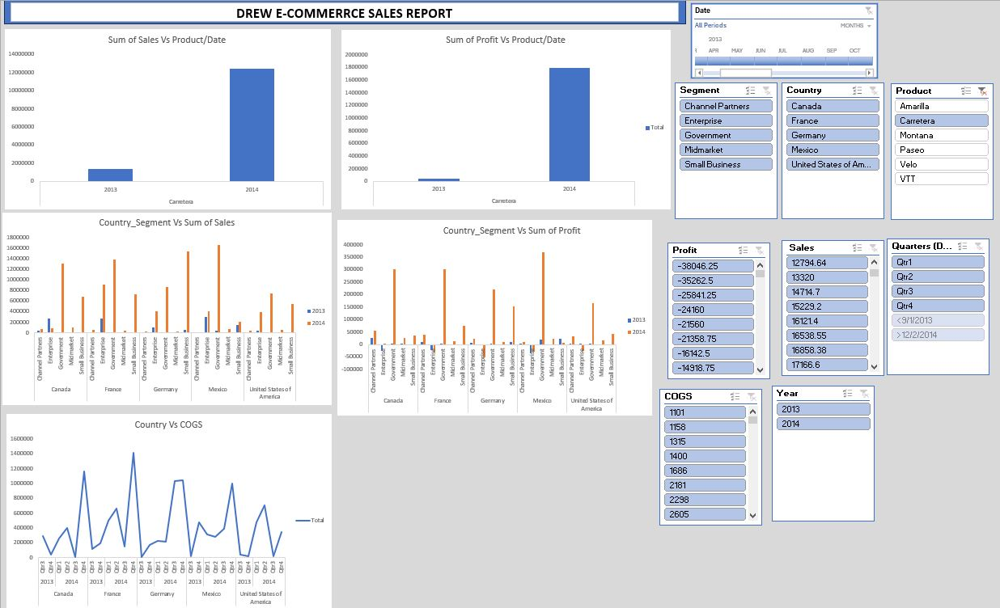
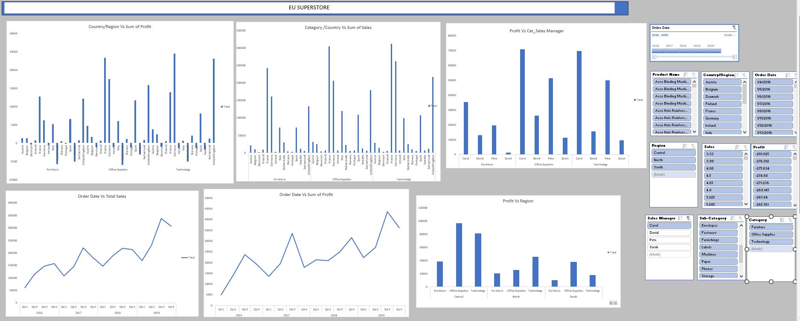
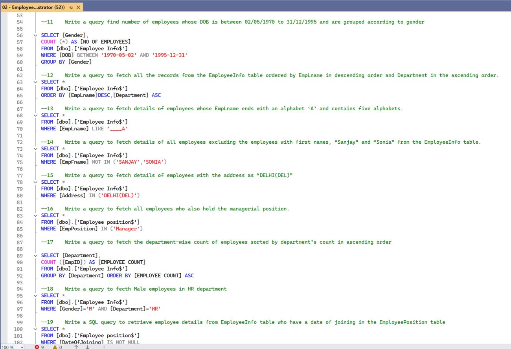
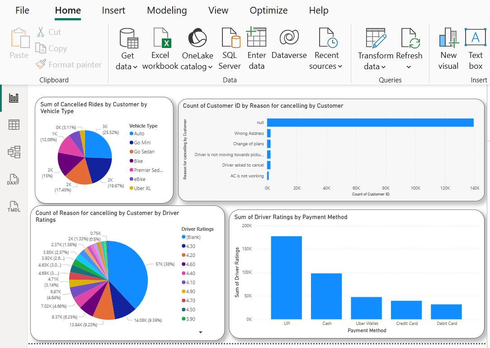
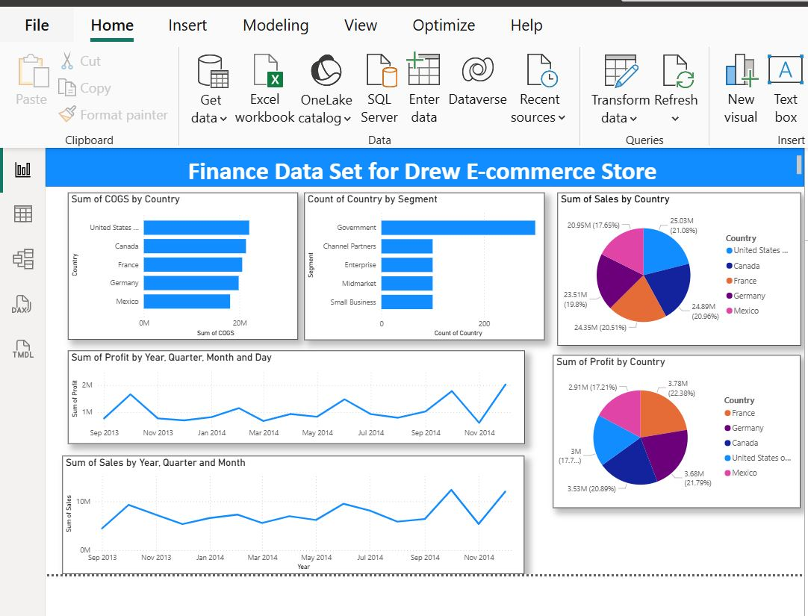

# Data Analytics Portfolio
# Project 1

**Title:** [DREWS ECOMMERCE SALES REPORT](https://github.com/AndrewOlayemi/AndrewOlayemi.github.io/blob/main/Excel1.JPG)

**Tools Used:** Microsoft Excel

**Project Description:** 

**Key findings:**

**Dashboard Overview:**

# Project 2

**Title:** [EU SUPERSTORE REPORT](https://github.com/AndrewOlayemi/AndrewOlayemi.github.io/blob/main/EU%20Superstore.JPG)

**Tools Used:**

**Project Description:**

**Key findings:**

**Dashboard Overview:**

# Project 3

**Title:** Employee Insight - Data Manipulation And Interrogation

**SQL Code:**

**SQL Skills Used:**
Data Retrieval & Sources

SELECT (extracting data)

FROM (specifying tables)

Aliasing (AS) for readable outputs

Filtering & Conditions

WHERE clause (row filtering)

BETWEEN (range filtering)

IN / NOT IN (list inclusion/exclusion)

AND (multiple conditions)

IS NOT NULL (null checks)

String & Text Functions

UPPER (convert to uppercase)

LEFT (extract characters)

SUBSTRING (substring extraction)

CHARINDEX (find position in string)

String concatenation (+)

Pattern matching (LIKE)

Aggregation & Grouping

COUNT (row aggregation)

GROUP BY (grouped calculations)

Sorting & Limiting

ORDER BY (ascending/descending)

TOP (limit number of rows)

Date & Time Functions

GETDATE (current system date/time)

Table Operations

SELECT INTO (create new table with data/structure)

**Project Description:**

**Technology used:** SQL server

# Project 4

**Title:** [Uber Ride Analytics Dataset](https://github.com/AndrewOlayemi/AndrewOlayemi.github.io/blob/main/Power_BI_Uber.JPG)

**Tools Used:**

**Project Description:**

**Key findings:**

**Dashboard Overview:**

# Project 5

**Title:** [Drew E-Commerce Dashboard](https://github.com/AndrewOlayemi/AndrewOlayemi.github.io/blob/main/Power_BI_Dashboard_Drew_Eccommerce.JPG)

**Tools Used:**

**Project Description:**

**Key findings:**

**Dashboard Overview:**

